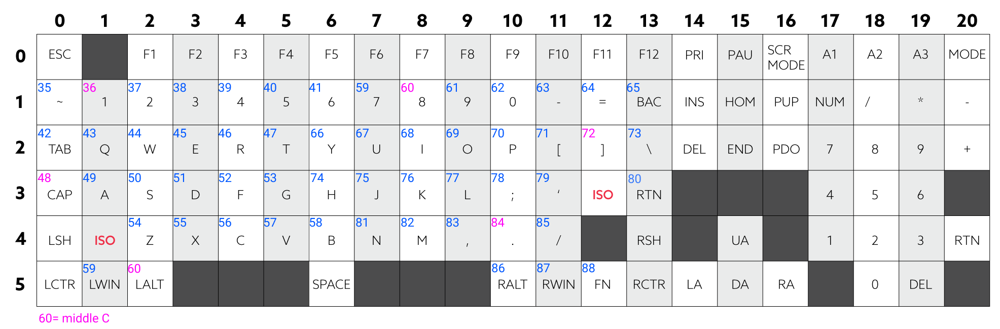

This project is library to makes wooting midi keyboard.


features
- corresponds to velocity
- can press 16 keys simultaneously

os
- windows

wooting is the analog mechanical keyboard
https://www.wooting.nl/


## Set up

install packages
```
pipenv install
```

## Test sending midi

```
pipenv shell
python example/check_midi_ports.py

['Microsoft GS Wavetable Synth 0', 'Maschine Jam - 1 4', 'Drums 6', 'Synth 7', 'woot_music_keyboard 8']
```

edit your port num to you want to send in 'example/send_midi.py'
```
# select a port you want to send midi messages
midiout.open_port(5)

```

If you need a virtual midi port, I recommend to use [loopmidi](https://www.tobias-erichsen.de/software/loopmidi.html)

## run example
```
pipenv shell
python example/send_midi.py
```

## Default MIDI map



## TODOS
- recieve the midi and illuminate the keys.
- octave shift
- scale mode
- illuminate according to the scale
- turn off the midi out on digital mode
